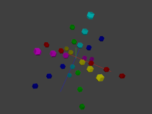
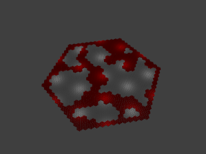

# rhombus

Hexagonal and Rhombic Dodecahedral worlds project

 

## Intention

This is a pet project, I will try to explore every fun idea related in any way to hexagonal
worlds. It started after I read the  [Hexagonal Grids](https://www.redblobgames.com/grids/hexagons/)
blog post.

One big thing to explore is 3D worlds made of rhombic dodecahedrons (honeycombs). The project
already has a coordinate system for it and can display dodecahedrons in 3D.

Another probably infinite thing to explore is world generators in 2D, 2D 1/2 and 3D. That will be
great fun.

Now that the 3D display and navigation and the `README.md` are correct, it is high time I started
exploring the fun parts.

What works in 2D:

- Hexagonal coordinates (cubic, axial).
- Ring iterator (hexagon shape).
- Display with 3D view for exploration.
- Very basic manual world builder: you control where you go, the builder remember the path
  and builds walls along it.
- Very basic manual 2D 1/2 world builder: same principal except that there is no wall but
  ceilings, you can go up and down provided your head don't hit the ceiling.
- Cellular automaton
- (WIP) Rooms and mazes

What works in 3D:

- Dodecahedral coordinates (quadric).
- Sphere iterator (cuboctahedron shape).
- Display with 3D view for exploration.

## Running the program

- `cargo run` will alternatively demonstrate the 3 basic things in both 2D and 3D:
directions, ring/sphere, ring/sphere iteration.
- `cargo run -- --help` will show you how to run the other things (e.g. `cargo run -- hex-flat-builder`,
  `cargo run -- hex-bumpy-builder`)

## Bibliography

This project would never have been born without this awesome document about hexagonal grids:

* **Hexagonal Grids** (2013-2019): https://www.redblobgames.com/grids/hexagons/

It describes in a very clear way the coordinate systems that can be used to position something in
a 2D hexagonal world and more importantly how you can describe movements, rings, basic field of
view, path finding and even more.

All sources of information:

* **Hexagonal Grids** (2013-2019): https://www.redblobgames.com/grids/hexagons/
* **The Cellular Automaton Method for Cave Generation** (2012): https://jeremykun.com/2012/07/29/the-cellular-automaton-method-for-cave-generation/
* **Rooms and Mazes: A Procedural Dungeon Generator** (2014): http://journal.stuffwithstuff.com/2014/12/21/rooms-and-mazes/